# InnerOS Physical Guardian

InnerOS Physical Guardian turns existing cameras and building sensors into governed Physical AI without forcing customers to replace their security infrastructure.

The building already had eyes. We gave it perception, judgment, controlled action, verification and memory.

**Current proof, kept honest:**

- Real SiMa Modalix warm-session inference has been measured on 20 distinct 640x640 JPEG frames on September 15, 2026.
- Guardian's control loop keeps perception, policy, human approval, physical action, verification and evidence as separate truth layers.
- The permanent Guardian product is disclosed as pre-existing work; this repository contains the hackathon-specific SiMa integration, judge experience, evidence packaging and pitch material.

`SEE -> PERCEIVE -> UNDERSTAND OVER TIME -> DECIDE UNDER POLICY -> HUMAN APPROVAL -> ACT -> VERIFY -> PROVE`

Detector output alone is not the product. Guardian adds time, policy, authority, bounded action, independent verification and an Evidence Receipt that a judge or operator can inspect later.

> **Continuity first:** a new chat or agent must read `docs/PROJECT_CONTINUITY.md` before changing code. It records the permanent-product vs hackathon boundary, canonical SHAs, sponsor strategy, on-site sequence and safety invariants.

> **Event freeze:** the team is officially confirmed for the SiMa.ai onsite track. Read `docs/EVENT_FREEZE_2026-09-14.md` before making any pre-judge change. Do not submit this project through the LabLab online Intel flow.

## Why This Exists

Most buildings already have cameras, DVRs, NVRs, access systems and low-voltage devices. Replacing that estate is expensive, disruptive and creates another lock-in cycle. The practical path is to retrofit intelligence on top of what already works.

Physical Guardian is built for that reality. It can keep the camera investment in place, run perception locally where possible, reduce cloud-video dependence, preserve privacy boundaries and route every action through policy and human authority.

We do not sell another camera. We add intelligence and accountability to the cameras you already own.

## 30-Second Demo Story

A camera or staged webcam source provides a frame. SiMa Modalix performs efficient edge perception. Guardian normalizes the detection, reasons over time and zones, decides what policy allows, asks a human before action, executes only bounded actions, verifies the result through readback and stores an Evidence Receipt.

If any proof is missing, the system says so. A webcam preview is not SiMa truth. A detection is not an authorized action. A simulated fallback is not measured hardware. The demo is designed to fail closed rather than inflate truth.

## Architecture

```mermaid
flowchart LR
    A[Existing camera or webcam source] --> B[Bounded source adapter]
    B --> C[SiMa Modalix MLA perception]
    C --> D[Normalized detections]
    D --> E[Tracking and temporal context]
    E --> F[Guardian policy]
    F --> G[Human approval]
    G --> H[Bounded physical I/O]
    H --> I[Verification and readback]
    I --> J[Evidence Receipt and Forensic Replay]
```



The inference hardware can change. The safety and accountability chain stays intact.

See `docs/ARCHITECTURE_AND_PROOF.md`.

## What Guardian Adds Beyond Object Detection

| Layer | What it answers |
| --- | --- |
| Perception | What is visible in this frame? |
| Temporal context | What has been happening over time? |
| Policy | What is allowed, denied or requires escalation? |
| Human approval | Who authorized a physical action? |
| Bounded action | What low-impact action was requested and executed? |
| Verification | Did the expected physical/software state actually happen? |
| Evidence | Can we prove the source, decision, action and readback later? |

## Current Measured Hardware Proof (2026-09-15)

AntiGravity task `ops_b21694986b2d` passed a warm-session Modalix JPEG cadence proof using non-sensitive test frames. This proves a reusable warm target inference path. It does not yet certify the final webcam-to-Evidence-Receipt integration SHA.

| Measurement | Result |
| --- | ---: |
| Distinct 640x640 JPEG frames | 20 |
| Model load/build/init | 2614.001 ms, once for the session |
| Average host round trip | 84.96 ms |
| p50 host round trip | 81.42 ms |
| p95 / worst host round trip | 149.27 ms |
| Minimum host round trip | 79.09 ms |
| Sustained cadence | 11.77 fps |
| Average target preprocessing | 13.2 ms |
| Average target MLA inference | 27.96 ms |
| Average decode/postprocess | 37.18 ms |
| Corrupt JPEG behavior | `IMAGE_DECODE_FAILED`, failed closed |
| Post-error recovery | next valid frame passed without session restart |

Truth limits for this table:

- The frames produced low-confidence detections below Guardian's policy-action threshold of 0.25.
- Those detections are perception telemetry only, not successful security incidents or action triggers.
- Final webcam -> Guardian -> Modalix -> policy -> action -> verify -> Evidence Receipt integration is still pending Codex A final pushed SHA / hardware validation.

Earlier target proof also established a real aarch64 Modalix path using PyNeat 0.4.0 and real `runner.run([tensor])` calls that returned 10 output heads. Public docs intentionally omit private network addresses, credentials and unsafe connection details.

## Truth Discipline

The default offline path is allowed for rehearsal, but it stays labeled as fixture data. Strict live mode must not pass without source proof, fresh frame evidence, runtime identity, validated detections, policy truth, physical I/O truth and verification/readback truth.

Common labels:

- `SIMULATED_FIXTURE`: owned deterministic demo data.
- `HISTORICAL_BENCHMARK`: dated measurement evidence that cannot certify a new live frame.
- `MEASURED_SPONSOR_RUNTIME`: real sponsor hardware/runtime evidence for the current inference path.
- `PRODUCT_HTTP_READBACK`: permanent-product HTTP action plus verified software readback.
- `REAL_LOW_VOLTAGE_HARDWARE`: reserved for actual low-voltage hardware readback.
- `FAILED_CLOSED` or `UNVERIFIED`: the chain did not prove enough to claim success.

## Safety Boundary

Judge actions are low-impact and allowlisted: beacon warning, operator notification and reference attention light. Door unlock, alarm disable, arbitrary shell execution and gate opening are explicitly denied in the demo policy.

Human approval is required before the ACT stage can complete. Voice can explain, interrupt, re-verify, resume after the canonical gate or cancel safely. Voice cannot approve a new physical action or bypass policy.

## Use Cases

- Residential and commercial buildings with existing CCTV estates.
- Gated communities and campuses that need operator escalation without camera replacement.
- Warehouses and industrial sites with after-hours or restricted-zone monitoring.
- Security integrators and managed service providers that need a portable Physical AI layer.

Example scenarios include restricted-zone activity, loitering, repeated access attempts, after-hours activity, unattended object review, operator escalation and bounded beacon/light/notification/relay actions. The system does not claim criminal intent or guaranteed incident prevention.

## Run the Judge Application

Requires Python 3.11+ and no third-party Python package for the demo runtime.

```bash
python3 scripts/run_demo.py
```

Open `http://127.0.0.1:8787`.

Before presenting, exercise the governed lifecycle with:

```bash
python3 scripts/judge_rehearsal.py
```

When real SiMa inference and Physical I/O readback are connected, the strict truth gate is:

```bash
python3 scripts/judge_rehearsal.py --runtime sima-slot --require-measured-sponsor --require-live-physical
```

The complete demo must not be described as live if that strict gate fails.

## Zero-Dependency Acceptance Check

A clean Python host can validate the application without installing pytest or any package:

```bash
python3 scripts/self_test.py
```

The acceptance script boots ephemeral loopback servers and verifies the offline runtime, human approval gate, safe reject path, dangerous-action fail-closed behavior, Physical I/O contract/readback, WebUI delivery, HTTP demo flow, evidence production and optional hosted authentication.

The developer test suite remains available when pytest is installed:

```bash
python3 -m pytest -q
```

## Repository Map

- `app/` - single-screen judge WebUI.
- `src/guardian_demo/` - demo engine, sponsor runtime boundary, Physical I/O bridge, voice lane and HTTP server.
- `scripts/run_demo.py` - one-command application start.
- `scripts/judge_rehearsal.py` - lifecycle rehearsal and strict live truth gate.
- `scripts/sima_onsite_preflight.py` - SiMa host/device readiness checks.
- `scripts/sima_capture_evidence.py` - sponsor evidence/benchmark capture with truth gating.
- `scripts/self_test.py` - zero-dependency acceptance test.
- `docs/ENGLISH_PITCH.md` - presentation scripts and judge Q&A.
- `docs/DEMO_STORY.md` - demo narrative and stage direction.
- `docs/COMMERCIAL_STORY.md` - buyer and integrator narrative.
- `docs/ARCHITECTURE_AND_PROOF.md` - truth-layer architecture and proof status.
- `docs/FAQ.md` - crisp answers for judges and partners.
- `PREEXISTING_DISCLOSURE.md`, `BASELINE_PROVENANCE.json`, `HACKATHON_SCOPE.md` - frozen provenance boundary.

## Hackathon Delta vs Pre-Existing Product

Permanent product:

`Rafa-Innerchispa/inneros-physical-guardian`

Hackathon composition:

`Rafa-Innerchispa/inneros-physical-guardian-ai-infra-2026`

The permanent product existed before the hackathon and owns reusable camera ingestion, RTSP/ONVIF, tracking, zones, temporal analysis, edge transport, policy, Physical I/O and evidence foundations. This repository owns the competition-specific SiMa runtime path, judge console, evidence/benchmark gates, demo orchestration, Speechmatics bonus integration and public story package.

See `PREEXISTING_DISCLOSURE.md`, `BASELINE_PROVENANCE.json` and `HACKATHON_SCOPE.md`.

## Roadmap And Current Integration Status

SiMa gives the building efficient edge perception. InnerOS Guardian turns that perception into governed physical action with interruption, verification and evidence. The immediate next milestone is Codex A's final pushed backend candidate and hardware validation for the full webcam -> Guardian -> Modalix -> policy -> action -> verify -> Evidence Receipt chain.

Until that proof lands, the repository should present the Modalix warm-session measurement as real hardware proof for perception only, not as an end-to-end live security incident.

## Team

**InnerOS Physical Guardian**

The team is intentionally small and grounded in real building-security integration constraints in Ecuador and Latin America: mixed camera generations, limited replacement budgets, local-first resilience and the need to keep existing infrastructure working while intelligence is added.
