# Architecture And Proof - InnerOS Physical Guardian

## Core Loop

`SEE -> PERCEIVE -> UNDERSTAND OVER TIME -> DECIDE UNDER POLICY -> HUMAN APPROVAL -> ACT -> VERIFY -> PROVE`

## System Architecture

```mermaid
flowchart LR
    A[Camera or webcam source] --> B[Bounded source adapter]
    B --> C[SiMa Modalix MLA perception]
    C --> D[Normalized detections]
    D --> E[Tracking and temporal context]
    E --> F[Guardian policy]
    F --> G[Human approval]
    G --> H[Bounded physical I/O]
    H --> I[Verification and readback]
    I --> J[Evidence Receipt]
    J --> K[Forensic Replay]
```

## What Each Layer Proves

| Layer | Truth question | Fail-closed condition |
| --- | --- | --- |
| Source truth | Which camera/frame/source produced the input? | Missing, stale or mismatched source identity. |
| Inference truth | Which model/runtime/device produced detections? | Fixture, historical benchmark, missing runtime proof or unavailable SiMa path. |
| Detection truth | Are bbox/class/confidence values valid for the frame? | Malformed bbox, non-numeric confidence, confidence outside range or frame mismatch. |
| Temporal truth | What has been happening over time? | Single-frame evidence is not enough for a temporal claim. |
| Policy truth | What action is allowed, denied or escalated? | Missing reason codes or threshold semantics. |
| Approval truth | Who authorized or denied action? | No human approval for action completion. |
| Action truth | What bounded action was requested/executed? | Unknown, dangerous or unmapped action. |
| Verification truth | Did the expected physical/software state happen? | Missing readback, failed readback or unknown physical truth. |
| Evidence truth | Can the chain be inspected later? | Missing Evidence Receipt, stale source, or unverifiable seal/source linkage. |

## Sponsor Boundary

SiMa Modalix is the efficient onsite edge perception accelerator/runtime for this track. Guardian remains vendor-neutral above it.

SiMa handles efficient local perception. Guardian handles temporal context, policy, human authorization, bounded action, independent verification and evidence.

Earlier target proof established:

- target architecture: aarch64;
- PyNeat version: 0.4.0;
- model path: `/media/nvme/models/yolo26m-seg-bf16-b1.tar.gz`;
- real `runner.run([tensor])` calls returned 10 output heads.

Public documentation intentionally omits private LAN addresses, credentials and unsafe connection details.

## Current Measured Hardware Proof - 2026-09-15

AntiGravity task `ops_b21694986b2d` passed a warm-session Modalix JPEG cadence proof:

| Evidence item | Result |
| --- | --- |
| Input set | 20 distinct non-sensitive 640x640 JPEG frames |
| Runtime | Real warm-session Modalix MLA |
| Model lifetime | Model loaded once |
| Model build/init | 2614.001 ms |
| Average host RTT | 84.96 ms |
| p50 host RTT | 81.42 ms |
| p95/worst host RTT | 149.27 ms |
| Minimum host RTT | 79.09 ms |
| Sustained cadence | 11.77 fps |
| Average target preprocessing | 13.2 ms |
| Average target MLA inference | 27.96 ms |
| Average decode/postprocess | 37.18 ms |
| Invalid JPEG | `IMAGE_DECODE_FAILED`, failed closed |
| Recovery | Next valid frame passed without session restart |

Truth limits:

- The test proves a reusable warm target perception path.
- The test used non-sensitive frames.
- The detected scores were below Guardian's action threshold of 0.25, so they remain perception telemetry only.
- The test does not prove a successful security incident.
- The test does not yet certify final webcam -> Guardian -> Modalix -> policy -> action -> verify -> Evidence Receipt integration.

## What Is Proven Today

- The repository preserves the permanent-product vs hackathon-composition boundary.
- The Guardian demo flow separates perception, policy, approval, action, verification and evidence.
- Strict truth discipline is documented: fixture data must not become measured sponsor runtime truth.
- A real SiMa Modalix warm-session JPEG inference path has measured latency/cadence and fail-closed corrupt-image recovery.
- The architecture can explain why a detector alone is not enough for governed Physical AI.
- Speechmatics remains a bonus voice lane and cannot approve or execute physical action by itself.

## What Still Requires Final Validation

- Codex A must publish the final backend candidate SHA.
- The final webcam source path must be linked to the same frame/source identity consumed by inference.
- The final Guardian runtime must reject fixture-to-measured inflation, stale/missing evidence, malformed detections, source/frame mismatch and unknown physical truth.
- The final Judge Console must consume backend truth labels without upgrading `UNVERIFIED` or `BLOCKED` responses.
- The full webcam -> Guardian -> Modalix -> policy -> human approval -> action -> verify -> Evidence Receipt chain must pass strict hardware validation before it is described as live.

## Provenance Boundary

The permanent InnerOS Physical Guardian product existed before the hackathon and is disclosed in `PREEXISTING_DISCLOSURE.md` and `BASELINE_PROVENANCE.json`.

This repository owns the hackathon-specific composition: SiMa runtime boundary, judge UI, evidence and benchmark gates, demo orchestration, Speechmatics bonus integration and public story package.

Every material claim should stay labeled as one of:

- `PRE-EXISTING`
- `NEW DURING HACKATHON`
- `ADAPTED DURING HACKATHON`
- `THIRD-PARTY / SPONSOR TECHNOLOGY`

## Claim Discipline

Do not claim:

- autonomous security guard behavior;
- criminal-intent detection;
- guaranteed incident prevention;
- production-ready safety-critical actuation;
- deployment at scale;
- live end-to-end SiMa success before strict hardware validation.

Use:

- governed;
- bounded;
- verifiable;
- portable;
- retrofit-first;
- fail-closed.
